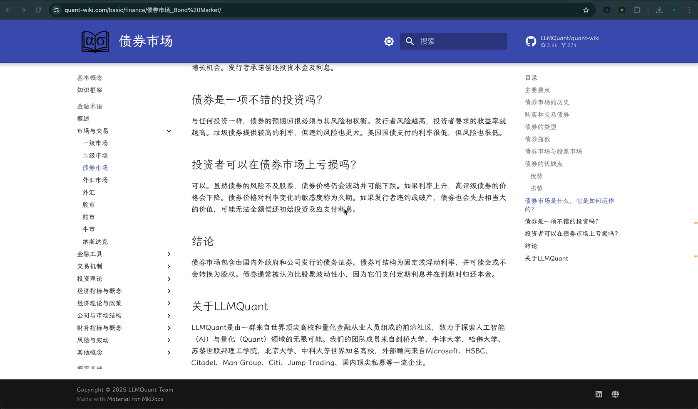

<div align="center">


# ✦ Context Explain

**在阅读的地方，获得 AI 的语境化解释。**

[](https://github.com/luzion89/context-explain/releases/latest)
[](LICENSE)
[](https://github.com/luzion89/context-explain/releases)
[](https://developer.chrome.com/docs/extensions/mv3/)

[English](README.md) · 中文 · [下载](https://github.com/luzion89/context-explain/releases/latest)

---



</div>

---

## ✦ 这是什么？

在任意网页上**划选任意文字**，旁边出现三个小按钮，点击即可获得 AI 解释——AI 理解你选中内容的上下文：前后的句子、页面的话题、文本的语体。

**右键单击任意图片**，即可让 AI 解释图片内容，或对图片提出具体问题。

不需要复制粘贴，不需要开新标签页，上下文不会丢失。

---

## 🆕 v2.0.0 新增功能

| # | 功能 | 说明 |
|---|---|---|
| 1 | 🖼️ **视觉 / 图片分析** | 右键任意图片 → 解释图片 / 对图片提问，使用独立的 Vision API |
| 2 | ⇌ **翻译模式** | 文字选中后的第三个按钮 — 翻译 + 1~2 句语境说明 |
| 3 | ↔️ **面板可调整大小** | 拖动 5 个边/角句柄调整大小，尺寸跨会话记忆 |
| 4 | 📌 **固定面板** | 点击页面其他位置时保持面板不关闭 |
| 5 | ↻ **重试按钮** | 流式失败或对结果不满意时重新运行上一次查询 |
| 6 | 🔍 **历史全文搜索 & 图片** | 跨所有条目全文搜索；图片条目显示缩略图 |
| 7 | ⚙️ **统一 AI 设置** | 文字 API 和视觉 API 分标签页；模型字段内联 ✓ 测试连接按钮 |
| 8 | 🌐 **界面语言本地化** | 设置界面语言跟随「回复语言」设置 |
| 9 | 📊 **Markdown 表格边框** | 面板和历史详情页均正确渲染表格边框 |
| 10 | 🎨 **主题与细节优化** | 独立的翻译目标语言设置；深色模式 WCAG 对比度；Enter 提交追问 |

---

## 🎯 有什么不同

### 理解语境，而不只是查字典

大多数查词工具把每个词单独处理。Context Explain 会抓取选中文字周围的段落，连同你的选择一起发给 AI。在机器学习论文里查 "Transformer"，得到的是架构解释；在电气工程页面查同一个词，得到的完全不同。

### 三种模式，对应三种意图

| 模式 | 图标 | 适合场景 |
|---|---|---|
| **解释模式** | ✦ | 让 AI 主动解释选中内容 |
| **提问模式** | ？ | 对选中的内容提出你自己的具体问题 |
| **翻译模式** | ⇌ | 翻译 + 1~2 句语境说明 |

**解释模式**适合你遇到陌生内容的情况——某个术语、概念、缩写，或者一段读不太懂的文字。

**提问模式**适合你已经理解文字本身，但有具体想法想进一步探讨的情况——比如：*"这个论点逻辑上成立吗？"*、*"能给个现实例子吗？"*、*"这和 X 有什么区别？"*

**翻译模式**不仅翻译成你设定的目标语言，还会附上一句关于文化或语境差异的简短说明，让你不只是看到译文，还能理解它。

### 视觉 / 图片分析

右键页面上任意图片，上下文菜单提供：
- **◆ 解释这张图片** — AI 描述并解释图片内容
- **？ 询问关于这张图片** — 输入你对图片的具体问题

视觉功能使用**独立的 API 配置**（端点、密钥、模型）——你可以为图片使用支持视觉的模型（如 GPT-4o、Claude 3、OpenRouter），同时为文字选中保留速度更快的文本模型。

### 对话可以持续

每次回答结束后，面板底部出现追问输入框。按 **Enter** 提交，**Ctrl+Enter** 换行。完整对话历史会随每次追问一起发送——要例子、深入展开、换个更简单的说法……AI 不会失去上下文。

### 面板可调整大小，可固定

拖动 **5 个调整句柄**（左下角、右下角、左侧边、右侧边、底部边）任意调整面板大小。你的尺寸**和**位置都会跨会话保存。

**📌 固定面板**，在你滚动页面、点击链接或阅读其他部分时保持面板不关闭。适合对照参考时使用。

### AI 返回什么，就渲染什么

- **Markdown** — 标题、加粗/斜体、表格（含边框）、有序/无序列表、引用块、行内代码、代码块（由 [marked.js](https://marked.github.io/marked/) 提供）
- **数学公式** — 通过 [KaTeX](https://katex.org/) 渲染行内和块级 LaTeX：$3x_1 + 5x_2 \leq 12$
- **流程图** — Mermaid 流程图、时序图、类图等，直接在面板内渲染为 SVG

### 划线标注会保留

每个查询过的文字段落，都会获得一条持久的**琥珀色下划线**。刷新页面后，下划线会自动恢复——通过上下文匹配精确定位到正确的那个。

### 滚动条小地图

视口右侧出现琥珀色细横条，标记每条注释在整个页面中的位置。

### Hover 即可复看，瞬间加载

鼠标悬停已标注的文字：**✦** 从缓存直接恢复完整对话（不调用 API），**✕** 移除标注并从历史记录中删除。

### 兼容 Immersive Translate 等翻译扩展

Context Explain 专门针对 [Immersive Translate](https://immersivetranslate.com/) 等会修改页面 DOM 的扩展进行了适配，选区检测同时监听 `mouseup` 和 `selectionchange` 事件，并在任何 DOM 变动使 Range 失效之前同步捕获选区。

### 不用 Service Worker，不会断流

所有 API 调用直接从 Content Script 发起——Content Script 和页面标签页共存亡，流式输出不会被 Chrome 提前中断。

---

## ✨ 功能一览

| | |
|---|---|
| 🤖 **支持的 AI 服务商** | OpenAI · Anthropic Claude · DeepSeek · 任意 OpenAI 兼容 API |
| 🖼️ **图片视觉分析** | 图片解释 & 提问，独立的 Vision API 配置 |
| ⇌ **翻译模式** | 翻译 + 语境说明；可配置目标语言 |
| 💬 **多轮对话** | 完整历史，无限追问 |
| 📐 **数学公式** | KaTeX — 行内和块级 LaTeX |
| 🔀 **流程图** | Mermaid — 流程图、时序图、类图、甘特图等 |
| 📝 **Markdown** | 完整 GFM（marked.js）— 带边框表格、任务列表、代码块 |
| 🖊️ **页面标注** | 琥珀色下划线，刷新后自动恢复 |
| 🗺️ **滚动条标记** | 全页面标注位置小地图 |
| 🪟 **面板** | 可拖动、可调整大小（5 个句柄）、可固定 — 位置和尺寸均保存 |
| 📌 **固定面板** | 与页面交互时保持面板不关闭 |
| ↻ **重试** | 失败或不满意时重新运行上一次查询 |
| 📚 **查询历史** | 全文搜索 · 导出 JSON · 单条删除 · 图片缩略图 |
| ⚡ **流式输出** | RAF 节流渲染，Markdown 一次性渲染 |
| 💾 **本地存储** | `chrome.storage.local` + `unlimitedStorage`，最多 2000 条 |
| 🌐 **界面本地化** | 设置界面支持 EN / 简体中文 / 日本語 / 한국어 |
| 🔒 **隐私** | 所有数据本地存储或直发你自己的 API，无第三方服务器 |

---

## 🚀 安装

### 方式一：下载 Release（推荐）

1. 前往 [**Releases 页面**](https://github.com/luzion89/context-explain/releases/latest)
2. 下载 `context-explain-v*.zip`
3. 解压
4. 打开 Chrome → `chrome://extensions` → 开启右上角**开发者模式**
5. 点击**加载已解压的扩展程序** → 选择解压出来的 `context-explain` 文件夹
6. 点击工具栏 **✦** 图标 → 填入 API Key → **保存设置**

### 方式二：克隆源码

```bash
git clone https://github.com/luzion89/context-explain.git
```

然后按上述步骤加载文件夹。

---

## ⚙️ 配置

点击工具栏 **✦** 图标打开设置。设置分为两个标签页：

### 文字 API

| 字段 | 说明 |
|---|---|
| **Provider（服务商）** | OpenAI / Anthropic / DeepSeek / 自定义 |
| **API Key** | 在对应服务商控制台获取 |
| **Model（模型）** | 留空使用默认值，或填写任意模型名称 — 使用 **✓** 内联测试连接 |
| **Base URL** | 仅自定义 OpenAI 兼容端点需要填写 |
| **Response Language（回复语言）** | 自动（匹配选中文字语言）或强制指定语言 |
| **Translation Target Language（翻译目标语言）** | 翻译模式 ⇌ 使用的目标语言 |

### 视觉 API

| 字段 | 说明 |
|---|---|
| **Vision Endpoint** | 任意 OpenAI 兼容的视觉端点（如 `https://api.openai.com/v1`） |
| **Vision API Key** | 视觉端点的密钥 |
| **Vision Model** | 如 `gpt-4o`、`claude-3-5-sonnet` 或 OpenRouter 模型 — 使用 **✓** 测试 |

### 推荐模型

| 使用场景 | 服务商 | 模型 |
|---|---|---|
| 日常快速查词 | OpenAI | `gpt-4o-mini` |
| 更丰富的解释 | Anthropic | `claude-3-5-sonnet-20241022` |
| 经济实惠 | DeepSeek | `deepseek-chat` |
| 图片分析 | OpenAI | `gpt-4o` |
| 通过 OpenRouter 分析图片 | OpenRouter | `google/gemini-flash-1.5` |

---

## 📖 使用方法

### 文字选中

```
1. 在任意网页上划选文字——一个字、一个词或整段文字均可
   ↓
2. 选中文字末尾出现三个按钮
   ✦  →  解释模式：AI 立即开始解释
   ？  →  提问模式：打开输入框，直接提问
   ⇌  →  翻译模式：翻译 + 简短语境说明
   ↓
3. 回答在浮动面板中流式显示
   数学公式、流程图、表格自动渲染
   ↓
4. 输出完成后，追问输入框出现——按 Enter 提交，Ctrl+Enter 换行
   ↓
5. 关闭面板——文字上的琥珀色下划线保留
   ↓
6. 随时 hover 下划线，瞬间重新加载历史对话
```

### 图片分析

```
1. 右键网页上任意图片
   ↓
2. 从上下文菜单选择：
   ◆ 解释这张图片  →  AI 描述并解释图片内容
   ？ 询问关于这张图片  →  输入你对图片的具体问题
   ↓
3. 回答在浮动面板中流式显示 — 与文字模式共用同一面板和追问流程
```

### 面板操作

| 操作 | 功能 |
|---|---|
| **拖动标题栏** | 移动面板 |
| **拖动边/角句柄** | 调整面板大小（5 个句柄：左下、右下、左侧、右侧、底部） |
| **📌 固定按钮** | 点击页面其他位置时保持面板不关闭 |
| **↻ 重试按钮** | 重新运行上一次查询 |
| **✕ 关闭** | 关闭面板（标注保留） |

---

## 🔒 隐私说明

- 选中的文字、上下文和图片**只发送**给你自己配置的 AI 服务商
- 本扩展**不与任何其他服务器通信**
- 所有历史记录通过 `chrome.storage.local` **存储在本地浏览器**
- 无数据收集 · 无追踪分析 · 无账户系统

---

## 🙏 灵感来源

[Select2Explain](https://github.com/luzion89/Select2Explain) —— 直接在阅读界面提供语境化 AI 解释的原始概念。

---

<div align="center">

**如果这个项目对你有帮助，欢迎点个 ⭐**

</div>
